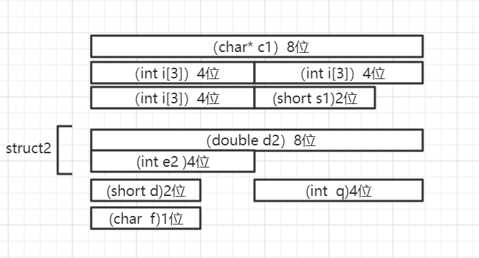

# C 结构体

## gcc 汇编标记

| 标记 | 英文                     | 解释         |
| ---- | ------------------------ | ------------ |
| LC0  | local constant           | 本地常量     |
| LFB0 | local function beginning | 本地函数开始 |
| LFE0 | local function ending    | 本地函数结束 |
| LBB0 | local block beginning    | 本地块开始   |
| LBE0 | local block ending       | 本地块结束   |
| L    | local labels             | 本地标记     |

## 汇编关联的信息

    -fverbose-asm

## 结构体

```cpp
typedef struct struct_t
{
    char c1;  // 1
    short s1; // 2
    int i1;   // 4
} struct_t;

struct_t data;
```

成员对齐，&i1 % 4 == 0 ; &s1 % 2 == 0

```cpp
typedef struct struct_t
{
    char c1;  // 1
    short s1; // 2
    int i1;   // 4
} __attribute__((packed)) struct_t;

struct_t data;
```

## 位操作

```cpp
typedef struct struct_t
{
    char c1 : 4; // 4 bit
    char c2 : 2; // 2 bit
    char c3 : 1; // 1
    char c4 : 1; // 1
} __attribute__((packed)) struct_t;

struct_t data;
```

## 结构体成员顺序

```cpp

typedef struct struct_t
{
    char c1;
    int i1;
    char c2;
    int i2;
    char c3;
    int i3;
} struct_t;

typedef struct struct_t
{
    int i1;
    int i2;
    int i3;

    char c1;
    char c2;
    char c3;
} struct_t;

struct_t data;
```

## 结构体成员对齐
```c
#include<stdio.h>
#pragma pack () //#pragma pack (n)指定代码以多少字节长度对其。pragma pack ()以默认方式对其(即自然对其)
typedef struct struct2{

    double d2;
    int e2;
}struct2;
typedef struct struct1{
    char* c1;
    int i[3];
    short s1;
    struct2 st2;
    short d;
    int q;
    short f;
}struct1;
int main(){
    struct1 s1;
    printf("%d",sizeof(struct1));
}
```
以上代码的内存结构图

一共需要7*8=56个字节,结构体是以空间换时间。
## 联合（共用体）

```cpp
typedef union union_t
{
    char value;
    struct_t m;
} union_t;
union_t udata;
```
联合体是通过共享一块内存实现的（即选择结构体中所占内存字节最大的成员变量的内存空间为共享段）联合体是以时间换空间。
## 枚举

```cpp
typedef enum enum_t
{
    ENUM1 = 1,
    ENUM2,
    ENUM3
} enum_t;

enum_t edata = 345;
```
