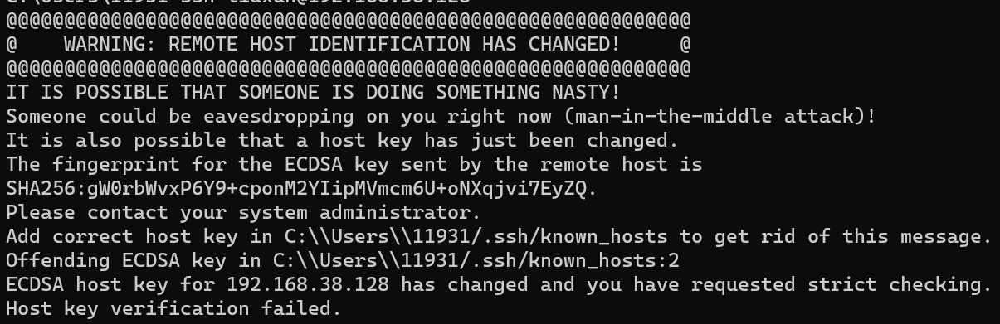
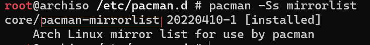
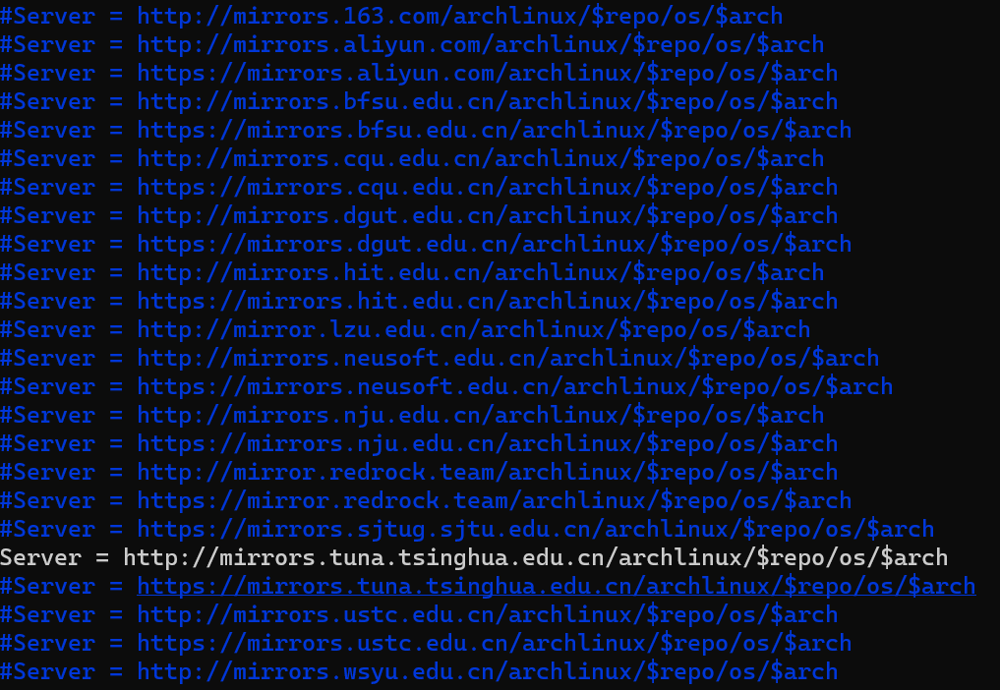
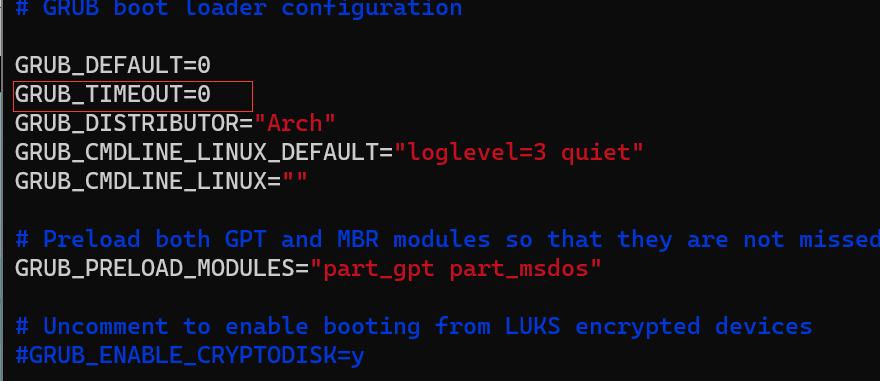

# VMWare 安装
官网地址：https://www.vmware.com/

注意点：
- 取消软件自动更新

# 安装Archlinux系统
## Archlinux系统pacman包管理器常用命令（地址：https://www.jianshu.com/p/ea651cdc5530）

安装教程地址：  
http://blog.ccyg.studio/article/4f6cfa0a-ad98-4adb-af08-79a8a5b1d674/
注意点:
- ArchLinux默认没有ifconfig命令请使用 ip addr 命令
- 出现error: failed to get canonical path of `airootfs' 是因为你没有安装系统并生成完成文件系统表后，没有输入 arch-chroot /mnt 进入系统如图所示
- 出现以下错误请删除 C:/Users/11931/.ssh/known_hosts下的192.168.....这一行
- 通过df -h命令可以查看磁盘的使用情况。 

## 安装镜像
- `pacman -Sy` 将pacman同步最新的数据库。出现问题请重启虚拟机
- `pacman -Ss mirrorlist` 在pacman中搜索镜像链接文件
- `pacman -S pacman-mirrorlist` 下载镜像链接文件
- `cd /etc/pacman.d` 然后`ls` 查看下载后的链接文件名
- 然后`cat mirrorlist.pacnew | grep China -A 24 > mirrorlist` 找到24个中国的镜像链接的添加到mirrorlist中
- 最后`vim mirrorlist`选着一个镜像http链接打开并保存。
## 安装系统引导
注意点：
- /dev/sdb 是磁盘不是分区。

#安装gnome图形界面
- `pacman -Syu` 更新系统
- `pacman -S gnome gnome-extra`,安装 gnome，出现选项之后点击 Enter，时间较长，请耐心等待，(若安装失败，请使用上面的命令更新系统)
- `pacman -S xorg xorg-xinit` 安装驱动
- `echo "exec gnome-session" > ~/.xinitrc` 编辑文件 ~/.xinitrc 输入 exec gnome-session 保存（在root和账户都要设置）
- 然后在虚拟机中输入命令 `startx` ，稍等片刻，就可以启动 gnome 图形界面了
- `vim /etc/default/grub` 打开default/grub修改GRUB_TIMEOUt的值为0
- `grub-mkconfig -o /boot/grub/grub.cfg` 更新grup配置文件。
- `systemctl enable gdm` 开机自启动图形化界面。
- 添加终端快捷键 https://blog.csdn.net/qq_15601471/article/details/92781475

# 安装bochs
注意点
- `bochs -q`
- `bkimage`
- `nasm hello.asm -o hello.bin`
- `dd if=hello.bin of=master.img bs=512 count=1 conv=notrunc`

# 编写程序
- hello.asm
``` asm
 mov ax, 3
  int 0x10
  mov ax, 0xb800
  mov ds,ax
  mov byte [0],'H'
  mov byte [1],11110000b
  mov byte [2],'E'
  mov byte [4],'L'
  mov byte [6],'L'

  mov byte [8],'O'
  mov byte [10],' '
  mov byte [12],'W'

  mov byte [14],'O'

  mov byte [16],'R'
  mov byte [18],'L'
  mov byte [20],'D'

  halt:
    jmp halt

  times 510 - ($ - $$) db 0
  db 0x55, 0xaa
```
- 05-06基础数据类型以及寻址方式
``` asm

offset equ 0x0000
data equ 0x1000
mov ax,1
mov ds,ax
mov ax,0x2000
mov ss,ax
int 0x10

xchg bx,bx
mov byte [offset],0x10 ;1字节
mov word [offset],0x1010 ;2字节
mov dword [offset],0x55aaeebb ;4字节

;bx bp si di
mov ax,[bx];[ds * 16 + bx]
mov ax,[bp];[ss * 16 + bp]
mov ax,[si];[ds * 16 + si]
mov ax,[di];[ds * 16 + di]

mov ax,[bx + si + 0x100];ds
mov ax,[bp + si + 0x100];ss


;[org 0x7c00]

; xchg bx,bx
; mov ax,0xb800
; mov es,ax
; mov ax,0
; mov si,message
; mov di,0
; mov cx, (message_end - message)
; loop1:

;   mov al,[ds:si]
;   mov [es:di],al
;   inc si
;   add di,2
;   loop loop1

halt:
	jmp halt
; message:
;   db "hello, world!!!",10
; message_end:

times 510 - ($ - $$) db 0 
db 0x55, 0xaa
```
 ## bug修改
- gnu/stubs-32.h:no such file or directory（没有安装32位的嵌入式c库）
  - 输入`pacman -Ss glibc`搜索32位的嵌入式c库
  - 输入`pacman -S lib32-glibc`安装32位的嵌入式c库

